# CatBot
1 con bot cùi bắp của ElectroHeavenVN
## Chức năng
- Phát SFX
- Text to speech (cung cấp bởi [Zalo AI](https://zalo.ai/products/text-to-audio-converter))
- Gửi emoji từ các server có bot và emoji CatAndSoup
- Phát nhạc từ [YouTube](https://www.youtube.com/) và [YouTube Music](https://music.youtube.com/) (cung cấp bởi [yt-dlp](https://github.com/yt-dlp/yt-dlp))
- Phát nhạc từ [NhacCuaTui](https://www.nhaccuatui.com/)
- Phát nhạc từ [Zing MP3](https://zingmp3.vn/)
- Phát nhạc từ [SoundCloud](https://soundcloud.com/) (cung cấp bởi [SoundCloudExplode](https://github.com/jerry08/SoundCloudExplode))
- Phát nhạc từ [Spotify](https://spotify.com/) (cung cấp bởi [SpotifyExplode](https://github.com/jerry08/SpotifyExplode) và [SpotifyDown](https://spotifydown.com/))
- Phát nhạc lưu trong bộ nhớ
- Tìm lời bài hát (cung cấp bởi [Lyrist](https://lyrist.vercel.app/))
## Setup
- Biên dịch dự án hoặc tải tệp thực thi từ [Release](../../releases) và chạy file DiscordBot.exe lần đầu tiên
- Sao chép nội dung trong file [Config_template.txt](Files/Config_template.txt) vào file Config.txt vừa được mở
- Thay đổi các thông số trong file Config.txt:
   + MainServerID: ID server chính dùng để quản lý bot (Sử dụng lệnh /admin, báo lỗi, cache ảnh cho [LocalMusic](Music/Local/LocalMusic.cs))
   + AdminServerID: ID server chứa các thành viên được sử dụng SFX đặc biệt và được sử dụng lệnh /emoji với emoji trong server này
   + CacheImageChannelID: ID kênh dùng để cache ảnh album của [LocalMusic](Music/Local/LocalMusic.cs) (Kênh này nằm trong server chính dùng để quản lý bot)
   + ExceptionReportChannelID: ID kênh dùng để báo lỗi khi bot chạy (Kênh này nằm trong server chính dùng để quản lý bot)
   + BotAuthorsID: Danh sách ID "tác giả" của bot (Người có quyền dùng lệnh /admin, addsfx, delsfx, downloadmusic)
   + SFXFolder: Đường dẫn lưu các tệp SFX, mặc định là `SFX`
   + SFXFolderSpecial: Đường dẫn lưu các tệp SFX đặc biệt, mặc định là `SFX\Special`
   + LyricAPI: API tìm lời bài hát, mặc định là `https://lyrist.vercel.app/api/`
   + LocalMusicIcon: Emoji dùng cho [LocalMusic](Music/Local/LocalMusic.cs) (tham khảo phần [Lấy raw string của emoji](#lay-raw-string-cua-emoji) để biết thêm chi tiết)
   + NCTIcon: Emoji dùng cho [NhacCuaTuiMusic](Music/NhacCuaTui/NhacCuaTuiMusic.cs) (tham khảo phần [Lấy raw string của emoji](#lay-raw-string-cua-emoji) để biết thêm chi tiết)
   + ZingMP3Icon: Emoji dùng cho [ZingMP3Music](Music/ZingMP3/ZingMP3Music.cs) (tham khảo phần [Lấy raw string của emoji](#lay-raw-string-cua-emoji) để biết thêm chi tiết)
   + YouTubeIcon, YouTubeMusicIcon: Emoji dùng cho [YouTubeMusic](Music/YouTube/YouTubeMusic.cs) (tham khảo phần [Lấy raw string của emoji](#lay-raw-string-cua-emoji) để biết thêm chi tiết)
   + SoundCloudIcon: Emoji dùng cho [SoundCloudMusic](Music/YouTube/SoundCloudMusic.cs) (tham khảo phần [Lấy raw string của emoji](#lay-raw-string-cua-emoji) để biết thêm chi tiết)
   + ZingMP3SecretKey: Zing MP3 secret key (tham khảo phần [Lấy Zing MP3 API key, Secret key và Cookie](#lay-zing-mp3-api-key-secret-key-va-cookie
) để biết thêm chi tiết)
   + ZingMP3APIKey: Zing MP3 API key (tham khảo phần [Lấy Zing MP3 API key, Secret key và Cookie](#lay-zing-mp3-api-key-secret-key-va-cookie
) để biết thêm chi tiết)
   + GoogleAPIKey: Google API key (tham khảo phần [Lấy Google API key](#lay-google-api-key) để biết thêm chi tiết)
   + ZaloAICookie: Zalo AI Cookie (tham khảo phần [Lấy Zalo AI cookie](#lay-zalo-ai-cookie) để biết thêm chi tiết)
   + UserAgent: User agent để thực hiện request
   + Sec-Ch-Ua: Sec-Ch-Ua header của Zing MP3 và Zalo AI (tham khảo phần [Lấy Sec-Ch-Ua header](#lay-sec-ch-ua-header) để biết thêm chi tiết)
   + BotTokenDebug: Token của bot khi biên dịch dự án ở chế độ Debug
   + BotToken: Token của bot khi biên dịch dự án ở chế độ Release
   + PrefixDebug: Prefix lệnh của bot khi biên dịch dự án ở chế độ Debug
   + Prefix: Prefix lệnh của bot khi biên dịch dự án ở chế độ Release
- Sau khi thay đổi các thông số phù hợp, chạy lại file DiscordBot.exe
## Lấy raw string của emoji
Sau khi thêm các file [Local.png](Files/Local.png), [NCT.png](Files/NCT.png), [YouTube.png](Files/YouTube.png), [YouTubeMusic.png](Files/YouTube.png)... vào danh sách emoji của server quản lý bot, chat "\\" + emoji để lấy raw string như hình dưới.

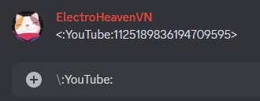
## Lấy Zing MP3 API key, Secret key và Cookie
- Truy cập [Zing MP3](https://zingmp3.vn/) và mở DevTools
### Lấy API key
- Chọn tab Sources, mở file main.min.js trong zjs.zmdcdn.me/zmp3-desktop/releases/v....../static/js

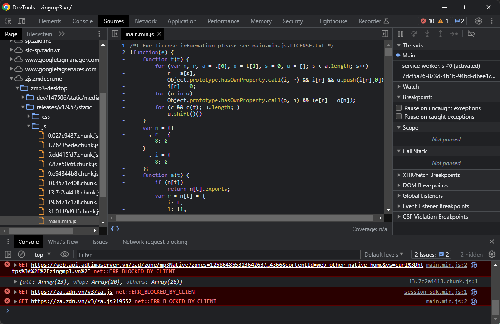
- Tìm kiếm từ khóa "apiKey" và đặt breakpoint tại dòng đó
 
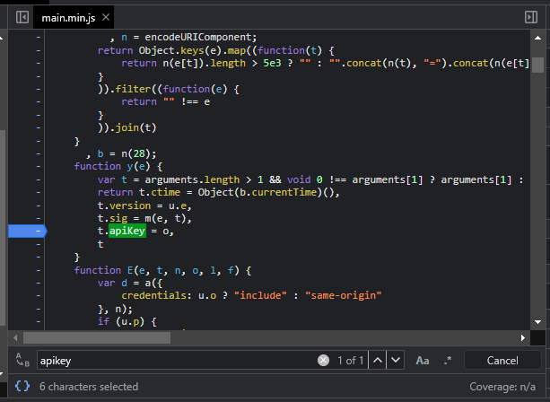
- Thực hiện một hành động bất kỳ (phát nhạc, tìm kiếm,...), breakpoint vừa đặt sẽ break
 
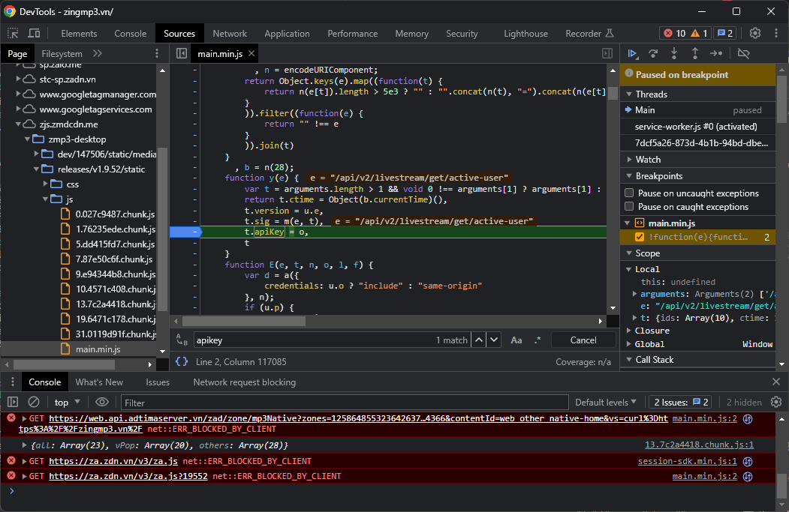
- Step over (F10), copy *.apiKey vào phần Console và nhấn Enter, giá trị nhận được là API key của Zing MP3.
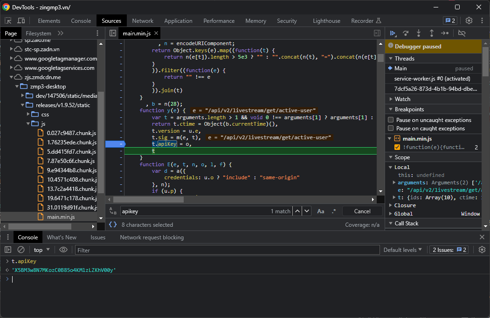

### Lấy Secret key
- 3 bước đầu làm tương tự như lấy API key
- Đến vị trí của hàm trả về giá trị cho *.sig (ngay bên trên *.apiKey)

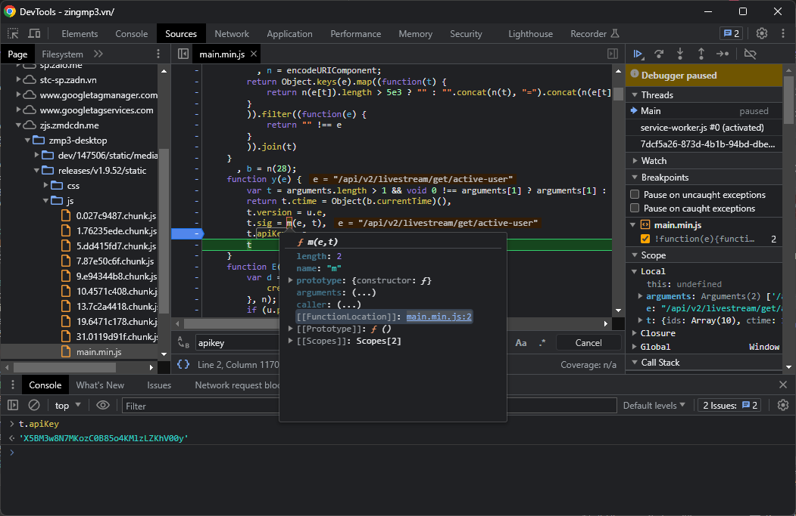
- Chuỗi có độ dài 32 ở cuối hàm chính là Secret key.

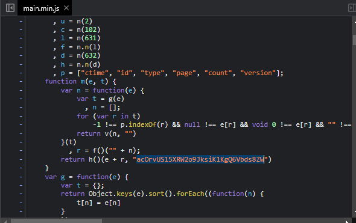
### Lấy Cookie
- Chọn tab Network trong DevTools
- Phát một bài nhạc bất kỳ
- Chọn 1 request bất kỳ có chứa từ "streaming", mở tab Header, nội dung phần Cookie chính là cookie của Zing MP3 (lưu ý loại trừ đoạn "zmp3_app_version.1=....;")

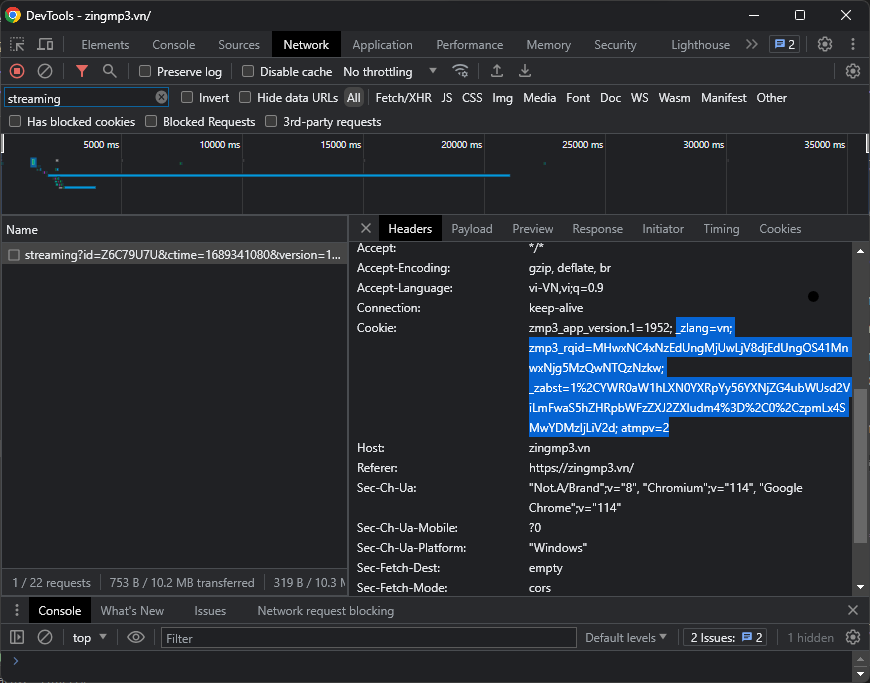
## Lấy Google API key
Tham khảo bài viết [Hướng dẫn lấy API key Youtube chi tiết](https://www.magetop.com/blog/cach-lay-api-key-youtube/) để biết cách lấy API key.
## Lấy Zalo AI cookie
- Truy cập [Zalo AI](https://zalo.ai/products/text-to-audio-converter) và mở DevTools, chọn tab Network
- Nhập nội dung bất kỳ, sau đó nhấn "Convert into speech"
- Chọn 1 request bất kỳ có chứa từ "synthesize", mở tab Header, nội dung phần Cookie chính là cookie của Zalo AI.

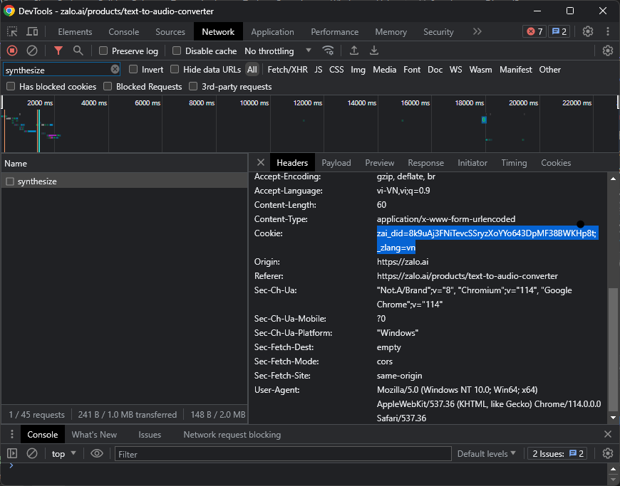
## Lấy User agent
- Mở DevTools, chọn tab Console
- Copy `navigator.userAgent` vào phần Console và nhấn Enter, giá trị nhận được chính là User agent. 

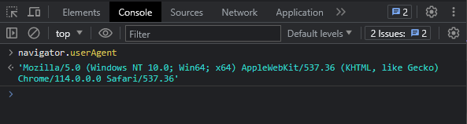
## Lấy Sec-Ch-Ua header
Tương tự phần [Lấy Cookie](#lay-cookie), nội dung phần Sec-Ch-Ua chính là Sec-Ch-Ua header.

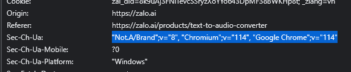
