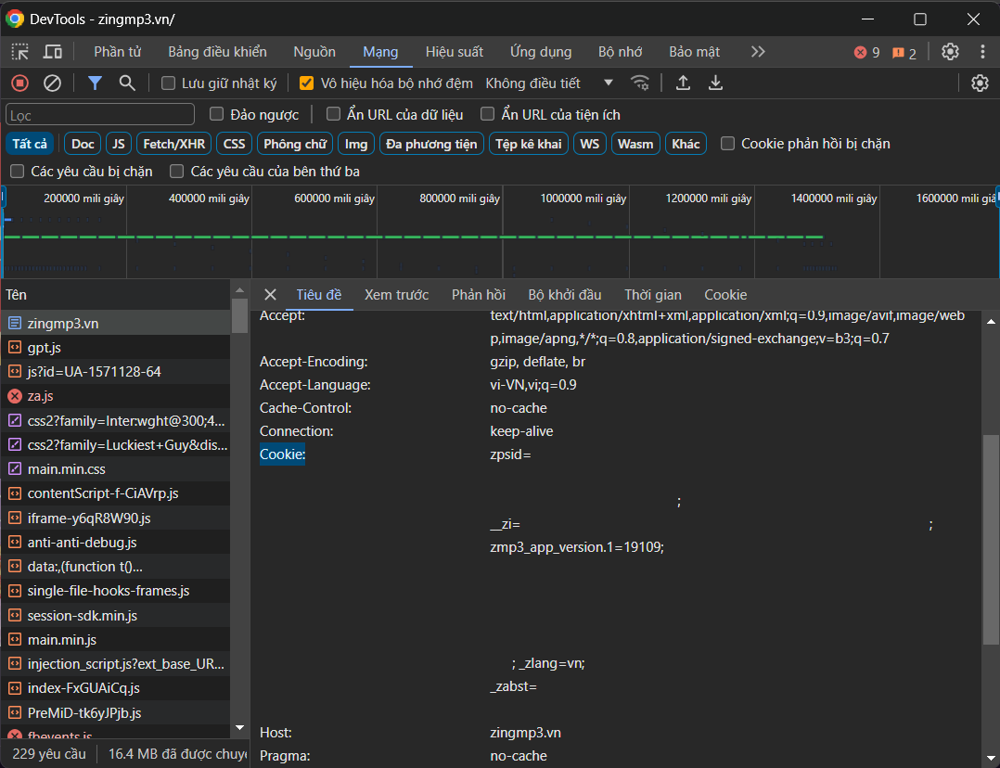

# CatBot
1 con bot Discord cùi bắp của ElectroHeavenVN
## Chức năng
- Phát SFX
- ~~Text to speech (cung cấp bởi [Zalo AI](https://zalo.ai/products/text-to-audio-converter))~~
- ~~Gửi emoji từ các server có bot và emoji CatAndSoup~~
- Phát nhạc từ [YouTube](https://www.youtube.com/) và [YouTube Music](https://music.youtube.com/) (cung cấp bởi [yt-dlp](https://github.com/yt-dlp/yt-dlp))
- Phát nhạc từ [NhacCuaTui](https://www.nhaccuatui.com/)
- Phát nhạc từ [Zing MP3](https://zingmp3.vn/)
- Phát nhạc từ [SoundCloud](https://soundcloud.com/) (cung cấp bởi [SoundCloudExplode](https://github.com/jerry08/SoundCloudExplode))
- Phát nhạc từ [Spotify](https://spotify.com/) (cung cấp bởi [SpotifyExplode](https://github.com/jerry08/SpotifyExplode), [Zotify](https://github.com/zotify-dev/zotify), [spotDL](https://github.com/spotDL/spotify-downloader) và [SpotifyDown](https://spotifydown.com/))
- Phát nhạc đã tải về trong máy
- Tìm lời bài hát (cung cấp bởi [Lyrist](https://lyrist.vercel.app/))
## Setup
- Biên dịch dự án hoặc tải tệp thực thi từ [Build CatBot Action](../../actions/workflows/Build.yml) và chạy file CatBot.exe lần đầu tiên, file `CatBot_config.json` sẽ được tạo mới
- Thay đổi các thông số trong file `CatBot_config.json`:
	+ `MainServerID`: ID server chính dùng để quản lý bot (Sử dụng lệnh `/admin`, báo lỗi, cache ảnh cho [LocalMusic](Music/Local/LocalMusic.cs))
	+ `AdminUsers`: Mảng chứa ID người dùng được sử dụng SFX đặc biệt ~~và được sử dụng lệnh `/emoji` với emoji trong server này~~
	+ `CacheImageChannelID`: ID kênh dùng để cache ảnh album của [LocalMusic](Music/Local/LocalMusic.cs) (Kênh này nằm trong server chính dùng để quản lý bot)
	+ `LogExceptionChannelID`: ID kênh dùng để báo lỗi khi bot chạy (Kênh này nằm trong server chính dùng để quản lý bot)
	+ ~~`DebugChannelID`: ID kênh dùng để debug~~
	+ `BotOwnersID`: Danh sách ID chủ của bot (Người có quyền dùng lệnh `/admin`, `addsfx`, `delsfx`, `downloadmusic`)
	+ `SFXFolder`: Đường dẫn lưu các tệp SFX, mặc định là `SFX`
	+ `SFXFolderSpecial`: Đường dẫn lưu các tệp SFX đặc biệt, mặc định là `SFX\Special`
	+ `LyricAPI`: API tìm lời bài hát, mặc định là `https://lyrist.vercel.app/api/`
	+ `ZingMP3SecretKey`: Zing MP3 secret key (tham khảo phần [Lấy Zing MP3 API key và Secret key](#lay-zing-mp3-api-key-va-secret-key) để biết thêm chi tiết)
	+ `ZingMP3APIKey`: Zing MP3 API key (tham khảo phần [Lấy Zing MP3 API key và Secret key](#lay-zing-mp3-api-key-va-secret-key) để biết thêm chi tiết)
	+ `ZingMP3Cookie`: Cookie Zing MP3 (tham khảo phần [Lấy Zing MP3 API key và Secret key](#lay-zing-mp3-api-key-va-secret-key) để biết thêm chi tiết), lưu ý loại trừ đoạn "zmp3_app_version.1=....;"
	+ `GoogleAPIKey`: Google API key (tham khảo phần [Lấy Google API key](#lay-google-api-key) để biết thêm chi tiết)
	+ ~~`ZaloAICookie:` Zalo AI Cookie (tham khảo phần [Lấy Cookie](#lay-cookie) để biết thêm chi tiết)~~
	+ `SpotifyCookie`: Cookie Spotify (tham khảo phần [Lấy Cookie](#lay-cookie) để biết thêm chi tiết)
	+ `SpotifyUsername`: Tên người dùng/email đăng nhập Spotify
	+ `SpotifyPassword`: Mật khẩu đăng nhập Spotify
	+ `UserAgent`: User agent để thực hiện request
	+ `BotToken`: Token của bot
	+ `DefaultPrefix`: Prefix lệnh của bot
	+ Emoji/Icon (tham khảo phần [Lấy raw string của emoji](#lay-raw-string-cua-emoji) để biết thêm chi tiết):
		+ `ZingMP3Icon`: Emoji dùng cho [ZingMP3Music](Music/ZingMP3/ZingMP3Music.cs)
		+ `YouTubeIcon`, `YouTubeMusicIcon`: Emoji dùng cho [YouTubeMusic](Music/YouTube/YouTubeMusic.cs)
		+ `SoundCloudIcon`: Emoji dùng cho [SoundCloudMusic](Music/SoundCloud/SoundCloudMusic.cs)
		+ `NCTIcon`: Emoji dùng cho [NhacCuaTuiMusic](Music/NhacCuaTui/NhacCuaTuiMusic.cs)
		+ `SpotifyIcon`: Emoji dùng cho [SpotifyMusic](Music/Spotify/SpotifyMusic.cs)
- Sau khi thay đổi các thông số phù hợp, chạy lại file CatBot.exe
## Lấy raw string của emoji
Sau khi thêm các file [Local.png](Files/Images/Local.png),[YouTube.png](Files/Images/YouTube.png), [YouTubeMusic.png](Files/Images/YouTubeMusic.png),  [Spotify.png](Files/Images/Spotify.png),... vào danh sách emoji của server quản lý bot, chat `\` + emoji để lấy raw string như hình dưới.

## Lấy Zing MP3 API key và Secret key
- Truy cập [Zing MP3](https://zingmp3.vn/) và mở DevTools
### Lấy API key
- Chọn tab Sources, mở file main.min.js trong zjs.zmdcdn.me/zmp3-desktop/releases/v....../static/js

- Tìm kiếm từ khóa "apiKey" và đặt breakpoint tại dòng đó
 

- Thực hiện một hành động bất kỳ (phát nhạc, tìm kiếm,...), breakpoint vừa đặt sẽ break
 

- Step over (F10), copy *.apiKey vào phần Console và nhấn Enter, giá trị nhận được là API key của Zing MP3.

### Lấy Secret key
- 3 bước đầu làm tương tự như lấy API key
- Đến vị trí của hàm trả về giá trị cho *.sig (ngay bên trên *.apiKey)

- Chuỗi có độ dài 32 ở cuối hàm chính là Secret key.

## Lấy Google API key
Tham khảo bài viết [Hướng dẫn lấy API key Youtube chi tiết](https://www.magetop.com/blog/cach-lay-api-key-youtube/) để biết cách lấy API key.

## Lấy Cookie
- Truy cập trang web muốn lấy cookie, sau đó mở DevTools và chọn tab Network
- Tải lại trang web
- Chọn 1 request đầu tiên (document), mở tab Header, nội dung phần Cookie chính là cookie của trang web

## Lấy User agent
- Mở DevTools, chọn tab Console
- Copy `navigator.userAgent` vào phần Console và nhấn Enter, giá trị nhận được chính là User agent. 

